# Complete ETH-ADVANCE Project-1

## Problem Statement:

Using Solidity and ether.js - build a simple DApp that will allow a particular organization to create a vesting schedule for their tokens. Depending on the tokenomics model of a web3 organization, they will have various vesting schedules for different stakeholders like community, investors, pre-sale buyers, founders etc.

## Key Objectives.

- Create Solidity contracts for registering orgs and adding stakeholders for each.
- Create a front end page for users to connect their wallet.
- Create a front end page for admins to register their org and add stakeholders + vesting details.
- Create a page for users to be able to withdraw if they are whitelisted otherwise only org admin should be able to withdraw.

## Purpose and Functionality.

Before Begining i want to inform that i purposely named wrong my variables in my smart contract and in the application. so please forgive me if it confuses anyone.

The purpose of this project is to provide an open system such that everyone can register their Decentralized Autonomous Organization (DAO). But only the Admin (those who registered their Organization) can add the stake holders to it. There are few Infomation that the Admin needs to fill about its stakeholders.

Information like :

- Stake Holder wallet public address,
- His Type(Founder, Pre Sale Buyer, Investor, Community)
- Amount he contributed
- His Validation Period (No. of years after which he can withdraw his fund)
  for Founders its 0, means they can withdraw instantly
  For Pre Sale Buyers its 1 years, means after 1 year they can withdraw their funds.
  For Investors its 2 years, means after 2 year they can withdraw their funds.
  For Community its 3 , means after 3 years they can withdraw their funds.

### 1. The Option to Add Stake Holders will be visible to only the Admin (Conditinoal Renderign) i.e. if current wallet address == owner address only then it will be visible.

### 2. The Option to whitelist the addresses too will only be visible to the Admin.

### 3. The option to Withdraw Money will be visible to all

- Except Admin Everyone can withdraw only that amount which is set by the Admin during their registration. (only if they are whitelisted)
- Admin can withdraw the whole amount (all amount stored in the contract)

### Withdraw Implimentation

For Simplicity i provided two withdraw options.

1. To withdraw if they are whitelisted
2. To withdraaw if they are whitelisted and fullfilled vasting period

One of them can be deleted during the time of actual deployment.

## Home Page


Home page consists of two buttons, one is to connect with the wallet and other is to go ahead with the Organization Registration.

Initially no wallet is connected with the site or if have just disconnect it.
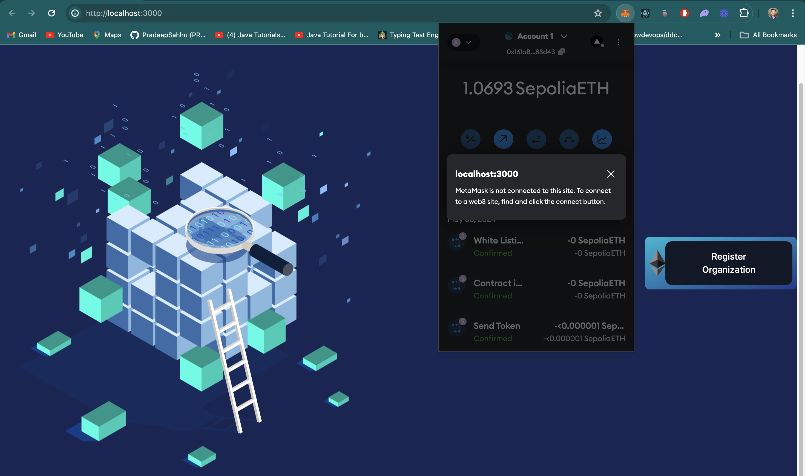

Now click on connect with wallet and a prompt to connect with it appears.

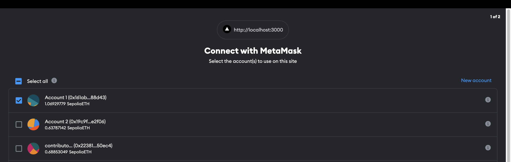

## Registration Page.

Click on second button i.e. Register the organization.


This is the Registration page to register your Decentralized Autonous Organization.
Anyone irrespective of any background can and will register their organization through here.

below it, we have the list of all already registered Organizatoins

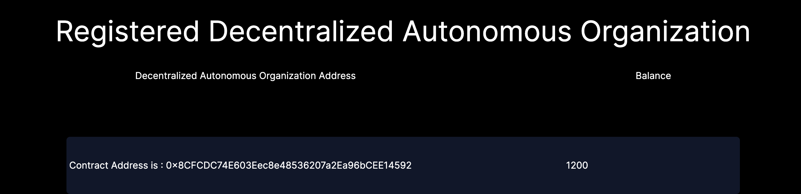

just click on one of them (click on their addresses)

## Contract Details Page (Admin View) (only visible to owner of the contract)

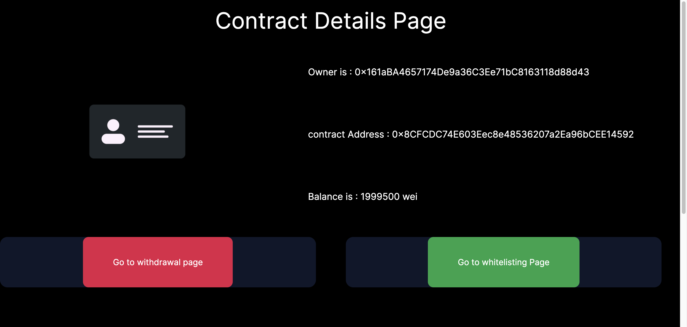

In this page, contains the information about

- the contract like who deployed it (Admin address) Clickable -> route to sepolia etherscan
- And Contract Address itself
- Contract total balance

Below it is Stake Holder Details page where Admin can register their stake holders. (any time & any where)

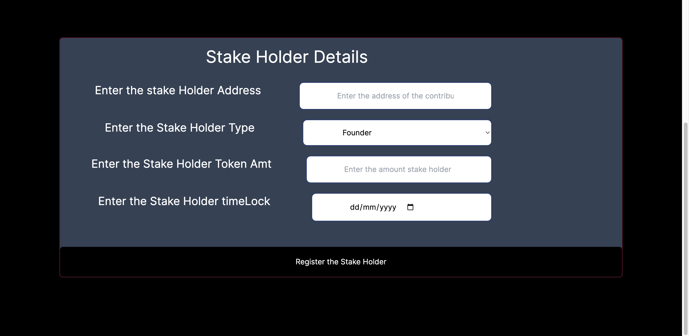

## Contract Details Page. (User View)

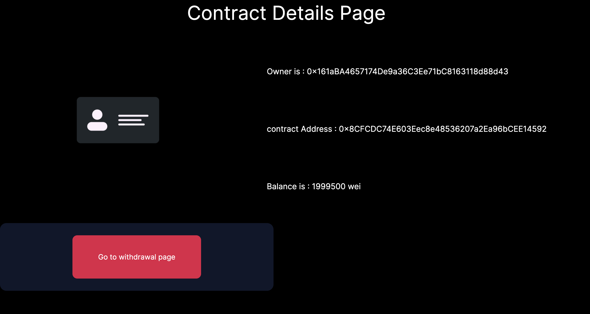

For Oter Users only Withdraw button is available (although in smart contract only Admin can whitelist the stake holders) but its important to provide front end security as well.

## Withdraw Page (Admin View)

The commonn page for all (Admin and Users)

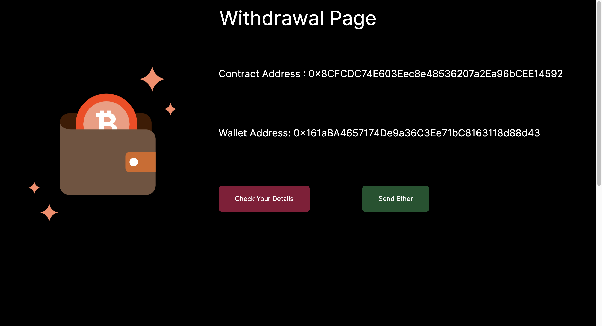

Remember here. ERC TOKENs = (ETH in wei) registered by the admin during registration step.

For admin there are two options avilable here. one is to withdraw the whole TOKENS(ETHs) from the contract and other is to add the tokens if their is some necessary in the future.

- By clicking the Show details page, for admin all the balance will be avialbe to him and its type will be creator. with no validation Period (time Lock)

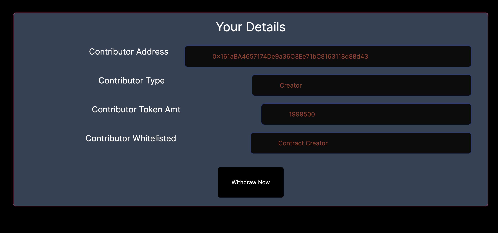

- By Clicking on Send Ether (only visible to admin the admin can add TOKENS(ETHs) in the contract)

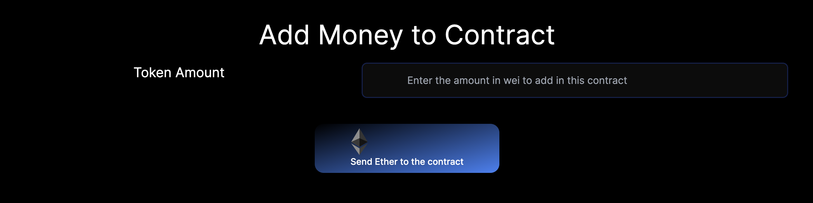

## withdraw page (user View)

first only show details option is available

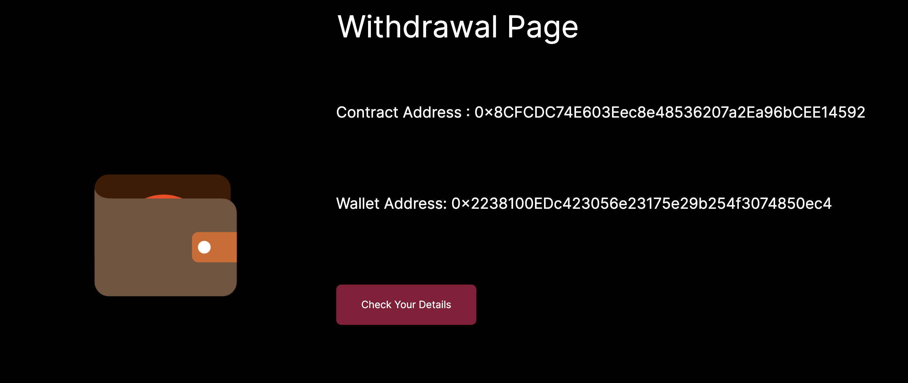

As i stated before, here all the details related to that user will be displayed like either which type he is , his time lock time and either he is white listed or not.

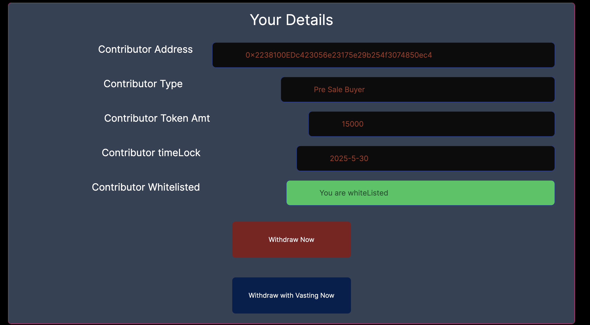

- (only for developmet purpose) There are two withdraw options available , one is to withdraw only when the user is white listed and other is to withdraw with both validation period and white listing.

## white listing Page (only Admin)

From here only admin can whitelist its stake holders (this view is restricted to admin only)

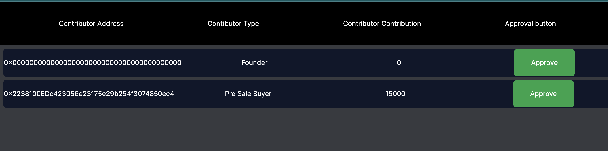


# Solidity Smart Contract Explanation


By default Owner is whitelisted it meaning those who registers his/her organization is the sole owner and made whitelisted by default. 

owner can withdraw the whole contract amount, any no. of times and owner can also add other stake holders, whitelist them.

only the whitelisted stake holders can withdraw his/her funds after their vasting time.

for vasting time : i implemented mathematics.

for founders vasting time is 0 years it means they can withdraw anytime they want.

so firstly i convert the date into number e.g. (YYYY-MM-DD) 2024-05-30 into Number 20240530.

and by using JS in frontend, according to stake holder type added the value in year section.

for Example (suppose there are 4 investors, 1 founder , 2 Pre Sale Buyer, 3, Investor, 4. Community) all invested on same day i.e. 2024-05-30

firstly i converted the date into number i.e. 2024-05-30 into 20240530 then added the number in year second according to investor type.


Founder added 0 = ( 2024+0 ) 0530= 20240530 = it means founders vasting (time lock) period is till 2024-05-30 only (same day)
Pre Sale Buyer 1 = (2024+1) 0530 = 20250530 = it means Pre Sale Buyer vasting (time lock) period is till 2025-05-30 only (after 1 year)
Investor 2 = (2024+2) 0530 = 20260530 = it means For investor vasting (time lock) period time is till 2026-06-30 only (after 2 years)

All this are done at the time of their registration such that later i can check if their vasting period is over or not. 
with the help of this modifier.


```Solidity
    modifier timeLock(uint vesting) {
        require(
            vastingData[msg.sender] <= vesting,
            "Your Vasting Period is not met"
        );
        _;
    }
```

in vesting parameter i am passing current date converted into number and checking if its stored vasting period is call then current number is or not. 

it it is less it means, the vasting time is over and now he can withdraw.

if not then it means time remeaning.


## Whole Solidity Code and Explanation fo Some useful functionalities.

```Solidity
// SPDX-License-Identifier: MIT
pragma solidity ^0.8.10;

contract DaoRegistractionFactory {
    address[] deployedContract;
    mapping(address => string) organizationName;

    constructor() {}

    function Registration(
        string memory _organizationToken,
        string memory _tokenSymbol,
        string memory _orgName
    ) public {
        address newContract = address(
            new DaoRegistration(_organizationToken, _tokenSymbol, msg.sender)
        );

        deployedContract.push(newContract);
        organizationName[newContract] = _orgName;
    }

    function getAllDeployedContract() public view returns (address[] memory) {
        return deployedContract;
    }

    function getNameOfOrganizations(
        address _contractAddress
    ) public view returns (string memory) {
        return organizationName[_contractAddress];
    }
}

contract DaoRegistration {
    string public organizationToken;
    string public tokenSymbol;
    address public immutable owner;

    // for constant data accessing through their address.
    mapping(address => bool) public whiteListedStackHolders;
    mapping(address => uint) public contributorsAmount;
    mapping(address => uint) public stakeHolderType;
    mapping(address => uint) public presentStakeHolder;
    mapping(address => stackHolder) public stakeHolderDetails;
    mapping(address => uint) public vastingData;

    address[] public stakeHolderAddresses;
    stackHolder[] public stakeHolders;

    struct stackHolder {
        address stakeHolderAddress;
        uint8 hisType; // 0 - founder , 1- pre_sale_buyer , 2 - investors , 3 - community
        uint256 stakesHold;
        uint boughtDate;
    }

    constructor(
        string memory _organizationToken,
        string memory _tokenSymbol,
        address _owner
    ) {
        owner = _owner;
        organizationToken = _organizationToken;
        tokenSymbol = _tokenSymbol;
        whiteListedStackHolders[owner] = true;
    }

    // modifiers

    modifier onlyNew(address _contriAddress) {
        require(
            presentStakeHolder[_contriAddress] == 0,
            "you are already present in the list"
        );
        _;
    }

    modifier onlyOwner() {
        require(msg.sender == owner, "you are not the owner");
        _;
    }

    modifier whiteListed() {
        require(
            whiteListedStackHolders[msg.sender] == true,
            "You are not white-listed stake holder"
        );
        _;
    }

    modifier timeLock(uint vesting) {
        require(
            vastingData[msg.sender] <= vesting,
            "Your Vasting Period is not met"
        );
        _;
    }

    //getters

    function getAllStackHolder() public view returns (stackHolder[] memory) {
        return stakeHolders;
    }

    function getOwner() public view returns (address) {
        return owner;
    }

    function getBalance() public view returns (uint) {
        return address(this).balance;
    }

    function getTypeOfStackHolder(
        address _contriddress
    ) public view returns (uint) {
        return stakeHolders[presentStakeHolder[_contriddress]].hisType;
    }

    function isWhiteListed(address _address) public view returns (bool) {
        return whiteListedStackHolders[_address];
    }

    function getContributorsAmount(
        address _address
    ) public view returns (uint256) {
        return contributorsAmount[_address];
    }

    function getPresentStakeHolder(
        address _address
    ) public view returns (uint256) {
        return presentStakeHolder[_address];
    }

    function getStakeHolderAddresses() public view returns (address[] memory) {
        return stakeHolderAddresses;
    }

    function getVastingTime(address _address) public view returns (uint) {
        return vastingData[_address];
    }

    // functionality

    function addingStackHolder(
        address _contributor,
        uint8 _hisType,
        uint256 _amount,
        uint256 _date
    ) public onlyNew(_contributor) onlyOwner {
        stackHolder memory newStakeHolder = stackHolder(
            _contributor,
            _hisType,
            _amount,
            _date
        );
        stakeHolders.push(newStakeHolder);

        // address mapping for constant operations.
        stakeHolderDetails[_contributor] = newStakeHolder;
        presentStakeHolder[_contributor] = stakeHolders.length;
        contributorsAmount[_contributor] = _amount;
        stakeHolderAddresses.push(_contributor); // adding stake holder address.
        vastingData[_contributor] = _date;
        stakeHolderType[_contributor] = _hisType;
    }

    function whiteListing(address _address) public onlyOwner {
        require(
            whiteListedStackHolders[_address] == false,
            "You are already white listed"
        );
        require(
            presentStakeHolder[_address] > 0,
            " you are present in the list"
        );
        whiteListedStackHolders[_address] = true;
    }

    // HERE TOKEN = ETHERS in (Wei)
    // Instead of sending ERC-20 Token i am allowing them to withdraw certain amount from the contract

    function sendToken() public payable onlyOwner {}

    function pseduoWithDrawTokens() public payable whiteListed {
        uint transferAmount = contributorsAmount[msg.sender];

        if (msg.sender == owner) {
            transferAmount = address(this).balance;
        }

        (bool callMsg, ) = payable(msg.sender).call{value: transferAmount}("");

        require(callMsg, "unsuccesful");

        // this Operations doesn't apply on owner like his account can't be removed from whitelist.
        if (msg.sender != owner) {
            whiteListedStackHolders[msg.sender] = false;
            contributorsAmount[msg.sender] = 0;
            presentStakeHolder[msg.sender] = 0;
            delete stakeHolderDetails[msg.sender];
            vastingData[msg.sender] = 0;
            delete stakeHolderAddresses[presentStakeHolder[msg.sender]];
            delete stakeHolders[presentStakeHolder[msg.sender]];
        }

        //     delete stakeHolders[presentStakeHolder[msg.sender]];

        //    whiteListedStackHolders[msg.sender] = false;
    }

    function withDrawTokens(
        uint vastingTime
    ) public payable whiteListed timeLock(vastingTime) {
        uint transferAmount = contributorsAmount[msg.sender];

        if (msg.sender == owner) {
            transferAmount = address(this).balance;
        }

        (bool callMsg, ) = payable(msg.sender).call{value: transferAmount}("");

        require(callMsg, "unsuccesful");

        // this Operations doesn't apply on owner like his account can't be removed from whitelist.
        if (msg.sender != owner) {
            whiteListedStackHolders[msg.sender] = false;
            delete stakeHolderAddresses[presentStakeHolder[msg.sender]];
            delete stakeHolders[presentStakeHolder[msg.sender]];
            contributorsAmount[msg.sender] = 0;
            presentStakeHolder[msg.sender] = 0;
            delete stakeHolderDetails[msg.sender];
            vastingData[msg.sender] = 0;
        }
    }

    // such that this contract can receive money externally with only contract address.

    receive() external payable {}

    fallback() external payable {}
}
```

## There are only 3 main functions in the solidity contract others are just for safety checks.

```Solidity
 function addingStackHolder(
        address _contributor,
        uint8 _hisType,
        uint256 _amount,
        uint256 _date
    ) public onlyNew(_contributor) onlyOwner {
        stackHolder memory newStakeHolder = stackHolder(
            _contributor,
            _hisType,
            _amount,
            _date
        );
        stakeHolders.push(newStakeHolder);

        // address mapping for constant operations.
        stakeHolderDetails[_contributor] = newStakeHolder;
        presentStakeHolder[_contributor] = stakeHolders.length;
        contributorsAmount[_contributor] = _amount;
        stakeHolderAddresses.push(_contributor); // adding stake holder address.
        vastingData[_contributor] = _date;
        stakeHolderType[_contributor] = _hisType;
    }
```

### 1. Add Stake Holder Function

This function is used to add the stake holder by taking inputs from the owner(only).
Inputs like type of stake holder, address of stake holder, how much wei they contributed and his vasting time (time of investment)


```Solidity
function whiteListing(address _address) public onlyOwner {
        require(
            whiteListedStackHolders[_address] == false,
            "You are already white listed"
        );
        require(
            presentStakeHolder[_address] > 0,
            " you are present in the list"
        );
        whiteListedStackHolders[_address] = true;
    }
```
### 2. Whitelisting Function 

This function as well will be executed by the owner of this organization (owner) as he/she must have the power to whitelist his investors.
firstly, its checking that the address should be not whitelisted and then in second require its checking that the address should be among the stake holders list.


### PseudoWithdraw && Withdraw Function.


```Solidity

 function pseduoWithDrawTokens() public payable whiteListed {
        uint transferAmount = contributorsAmount[msg.sender];

        if (msg.sender == owner) {
            transferAmount = address(this).balance;
        }

        (bool callMsg, ) = payable(msg.sender).call{value: transferAmount}("");

        require(callMsg, "unsuccesful");

        // this Operations doesn't apply on owner like his account can't be removed from whitelist.
        if (msg.sender != owner) {
            whiteListedStackHolders[msg.sender] = false;
            contributorsAmount[msg.sender] = 0;
            presentStakeHolder[msg.sender] = 0;
            delete stakeHolderDetails[msg.sender];
            vastingData[msg.sender] = 0;
            delete stakeHolderAddresses[presentStakeHolder[msg.sender]];
            delete stakeHolders[presentStakeHolder[msg.sender]];
        }

        //     delete stakeHolders[presentStakeHolder[msg.sender]];

        //    whiteListedStackHolders[msg.sender] = false;
    }

```

This is PseudoWithdraw function

This is named pseudo because it only checks either the withdrawal is whitelisted or not but in objective of this project its mensioned that we must also check its vasting period.

I implemented only whitelisted modifier in this function and implimented both whitelisted and vasting modifier in the withdrawal function.


Functionality: This function checks if the withdrawing address is whitelisted address or not , if it is then it allows it to withdraw.

if its not then revert the transaction.

After the successful withdrawal his address will be removed or made false from all the storing variables except the owner.


