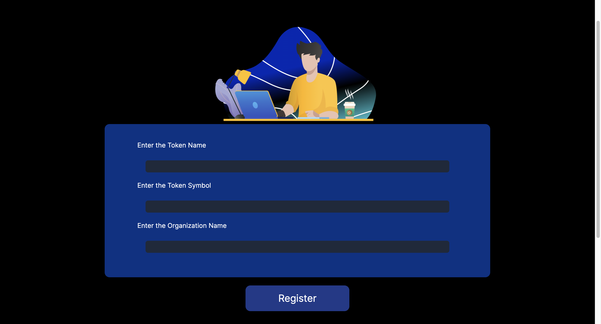

# Complete ETH-ADVANCE Project-1

## Problem Statement:

Using Solidity and ether.js - build a simple DApp that will allow a particular organization to create a vesting schedule for their tokens. Depending on the tokenomics model of a web3 organization, they will have various vesting schedules for different stakeholders like community, investors, pre-sale buyers, founders etc.

## Key Objectives.

- Create Solidity contracts for registering orgs and adding stakeholders for each.
- Create a front end page for users to connect their wallet.
- Create a front end page for admins to register their org and add stakeholders + vesting details.
- Create a page for users to be able to withdraw if they are whitelisted otherwise only org admin should be able to withdraw.

## Purpose and Functionality.

Before Begining i want to inform that i purposely named wrong my variables in my smart contract and in the application. so please forgive me if it confuses anyone.

The purpose of this project is to provide an open system such that everyone can register their Decentralized Autonomous Organization (DAO). But only the Admin (those who registered their Organization) can add the stake holders to it. There are few Infomation that the Admin needs to fill about its stakeholders.

Information like :

- Stake Holder wallet public address,
- His Type(Founder, Pre Sale Buyer, Investor, Community)
- Amount he contributed
- His Validation Period (No. of years after which he can withdraw his fund)
  for Founders its 0, means they can withdraw instantly
  For Pre Sale Buyers its 1 years, means after 1 year they can withdraw their funds.
  For Investors its 2 years, means after 2 year they can withdraw their funds.
  For Community its 3 , means after 3 years they can withdraw their funds.

### 1. The Option to Add Stake Holders will be visible to only the Admin (Conditinoal Renderign) i.e. if current wallet address == owner address only then it will be visible.

### 2. The Option to whitelist the addresses too will only be visible to the Admin.

### 3. The option to Withdraw Money will be visible to all

- Except Admin Everyone can withdraw only that amount which is set by the Admin during their registration. (only if they are whitelisted)
- Admin can withdraw the whole amount (all amount stored in the contract)

### Withdraw Implimentation

For Simplicity i provided two withdraw options.

1. To withdraw if they are whitelisted
2. To withdraaw if they are whitelisted and fullfilled vasting period

One of them can be deleted during the time of actual deployment.

## Home Page

Home page consists of two buttons, one is to connect with the wallet and other is to go ahead with the Organization Registration.

Initially no wallet is connected with the site or if have just disconnect it.

Now click on connect with wallet and a prompt to connect with it appears.

## Registration Page.

Click on second button i.e. Register the organization.

This is the Registration page to register your Decentralized Autonous Organization.
Anyone irrespective of any background can and will register their organization through here.

below it, we have the list of all already registered Organizatoins

just click on one of them (click on their addresses)

## Contract Details Page (Admin View) (only visible to owner of the contract)

In this page, contains the information about

- the contract like who deployed it (Admin address) Clickable -> route to sepolia etherscan
- And Contract Address itself
- Contract total balance

Below it is Stake Holder Details page where Admin can register their stake holders. (any time & any where)

## Contract Details Page. (User View)

For Oter Users only Withdraw button is available (although in smart contract only Admin can whitelist the stake holders) but its important to provide front end security as well.

## Withdraw Page (Admin View)

The commonn page for all (Admin and Users)

Remember here. ERC TOKENs = (ETH in wei) registered by the admin during registration step.

For admin there are two options avilable here. one is to withdraw the whole TOKENS(ETHs) from the contract and other is to add the tokens if their is some necessary in the future.

- By clicking the Show details page, for admin all the balance will be avialbe to him and its type will be creator. with no validation Period (time Lock)

- By Clicking on Send Ether (only visible to admin the admin can add TOKENS(ETHs) in the contract)

## withdraw page (user View)

first only show details option is available

As i stated before, here all the details related to that user will be displayed like either which type he is , his time lock time and either he is white listed or not.

- (only for developmet purpose) There are two withdraw options available , one is to withdraw only when the user is white listed and other is to withdraw with both validation period and white listing.

## white listing Page (only Admin)

From here only admin can whitelist its stake holders (this view is restricted to admin only)

